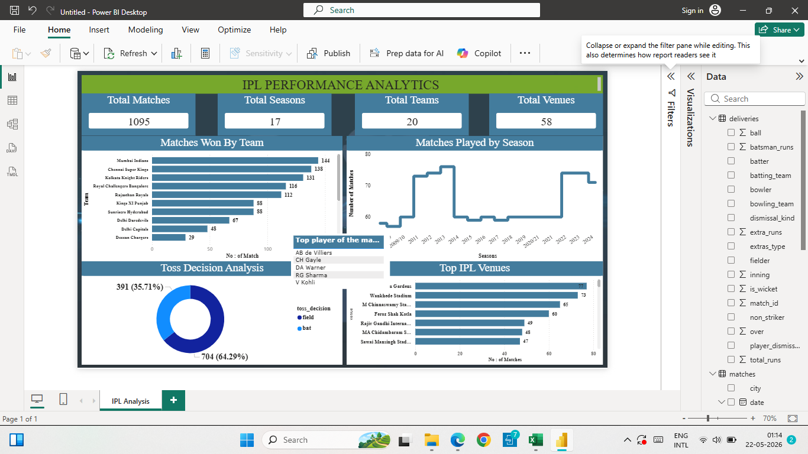

# 🏏 IPL Performance Analytics Dashboard

## 📌 Project Overview
This project analyzes IPL match data using Power BI to identify team performance, match trends, toss decisions, venue analysis, and player achievements.

The dashboard provides interactive cricket analytics insights using IPL historical match datasets.

---

# 🚀 Tools Used
- Power BI
- Excel
- Kaggle Dataset

---

# 📂 Dataset
Dataset sourced from Kaggle.

Files used:
- matches.csv
- deliveries.csv

The dataset contains:
- IPL match information
- team performance
- toss decisions
- venue details
- player statistics
- ball-by-ball delivery data

---

# 📊 Dashboard Features

## KPI Cards
- Total Matches
- Total Seasons
- Total Teams
- Total Venues

## Visualizations
- Matches Won by Team
- Matches Played by Season
- Toss Decision Analysis
- Top IPL Venues
- Top Player of the Match Winners

---

# 🧹 Data Preparation
- Checked null values
- Removed unnecessary blank rows
- Verified data relationships
- Connected matches and deliveries datasets
- Formatted charts and KPIs for visualization

---

# 📈 Key Insights
- Mumbai Indians won the highest number of matches.
- Most teams preferred fielding after winning toss.
- IPL match count increased significantly over seasons.
- Certain venues hosted more matches consistently.
- Some players dominated Player of the Match awards.

---

# 📸 Dashboard Preview



---

# 📁 Project Structure

```text
IPL-Analytics/
│
├── dataset/
│   ├── matches.csv
│   └── deliveries.csv
│
├── screenshot/
│   └── ipl_dashboard.png
│
├── ipl_dashboard.pbix
└── README.md
```

---

# 👨‍💻 Author
Chelva Choumya, 
M.Sc Mathematics Graduate | Aspiring Data Analyst
