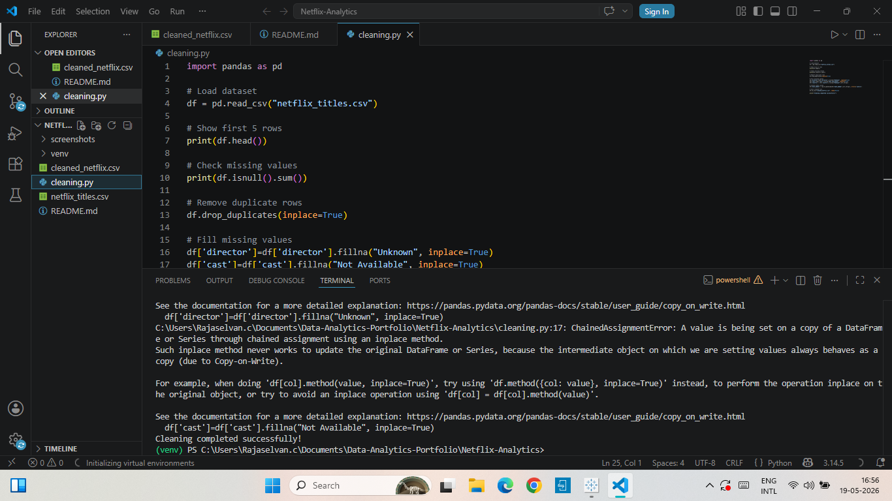
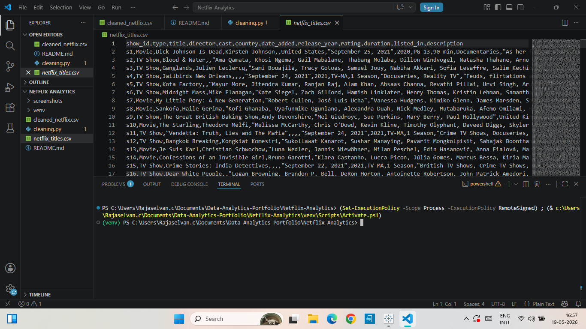
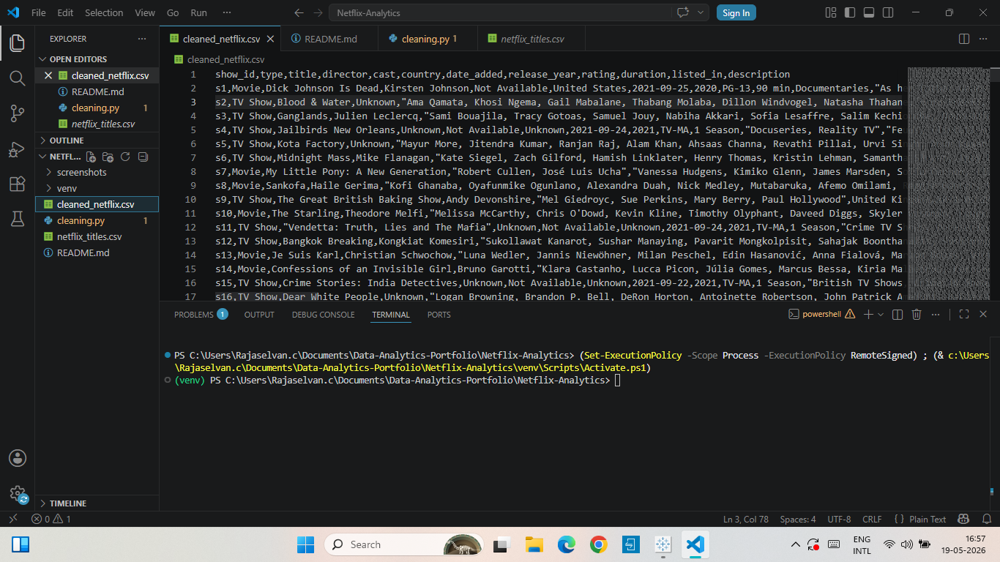
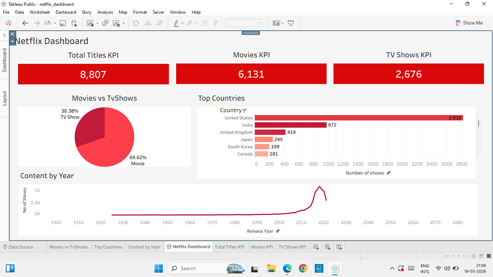

# Netflix Data Cleaning Project

## Objective
Cleaned and processed Netflix movies and TV shows dataset using Python and Pandas.

## Tools Used
- Python
- Pandas
- VS Code

## Tasks Performed
- Removed duplicate rows
- Handled missing values
- Converted date columns
- Exported cleaned dataset

## Files Included
- cleaning.py
- netflix_titles.csv
- cleaned_netflix.csv

## Output
Generated a cleaned Netflix dataset ready for analysis and visualization.
# Project Screenshots

## Python Cleaning Code and Output

## Raw Netflix Dataset

## Cleaned Netflix Dataset

## Dashboard Netflix Dataset

---

# 👨‍💻 Author
Chelva Choumya,
Msc Mathematics Graduate | Aspiring Data Analyst
