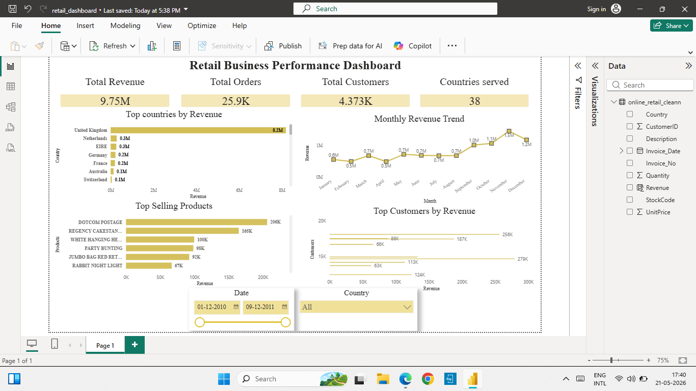

# 🛒 Retail Business Performance Intelligence Dashboard

## 📌 Project Overview
This project analyzes an online retail transaction dataset using SQL and Power BI.  
The goal is to understand business performance, revenue trends, top countries, best-selling products, and high-value customers.

This project is designed as a beginner-friendly but professional data analytics portfolio project.

---

## 🚀 Tools Used
- MySQL
- Power BI
- VS Code

---

## 📂 Dataset
Dataset used: Online Retail Dataset sourced from Kaggle.

The dataset contains:
- 500K+ retail transactions
- customer purchase information
- product details
- country-wise sales data
- invoice and revenue information

---

## 📊 Dashboard Features

### KPI Cards
- Total Revenue
- Total Orders
- Total Customers
- Countries Served

### Visualizations
- Top Countries by Revenue
- Monthly Revenue Trend
- Top Selling Products
- Top Customers by Revenue

### Filters
- Date Filter
- Country Filter

---

## 🧹 Data Cleaning and Preparation
- Removed null and blank values where required
- Filtered invalid quantities
- Converted invoice date into proper date format
- Created revenue calculation
- Cleaned product and country fields for better analysis

---

## 🧮 SQL Analysis Performed
- Total revenue analysis
- Country-wise revenue analysis
- Monthly revenue trend analysis
- Best-selling products analysis
- Top customer analysis

---

## 📈 Key Business Insights
- United Kingdom generated the highest revenue.
- Revenue increased strongly during later months.
- A few products contributed significantly to total sales.
- High-value customers played an important role in revenue generation.
- Country and date filters help analyze business performance interactively.

---

## 📸 Dashboard Preview



---

## 📁 Project Structure
```text

Online-Retail-Analytics/
│
├── dataset/
├── screenshots/
│   └── powerbi_dashboard.png
├── queries.sql
├── retail_dashboard.pbix
└── README.md
```
---

# 👨‍💻 Author
Chelva Choumya,
Msc Mathematics Graduate | Aspiring Data Analyst
